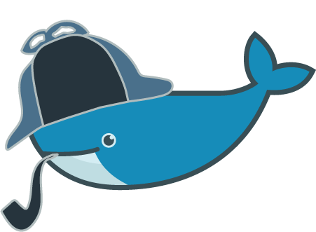

Sherdock
========



DockerCon 2015 Hackathon Project

## Features

* Automatic GC of images based on regexp
* Find and delete orphan Docker volumes
* UI

## Running

    docker run -d -v /var/lib/docker:/var/lib/docker -v /var/run/docker.sock:/var/run/docker.sock -p 8080:8080 rancherio/sherdock

UI at http://localhost:8008

## Developing

```bash

# Update UI
./script/build-ui

# Run
./script/run
```

## Release

    ./script/package
